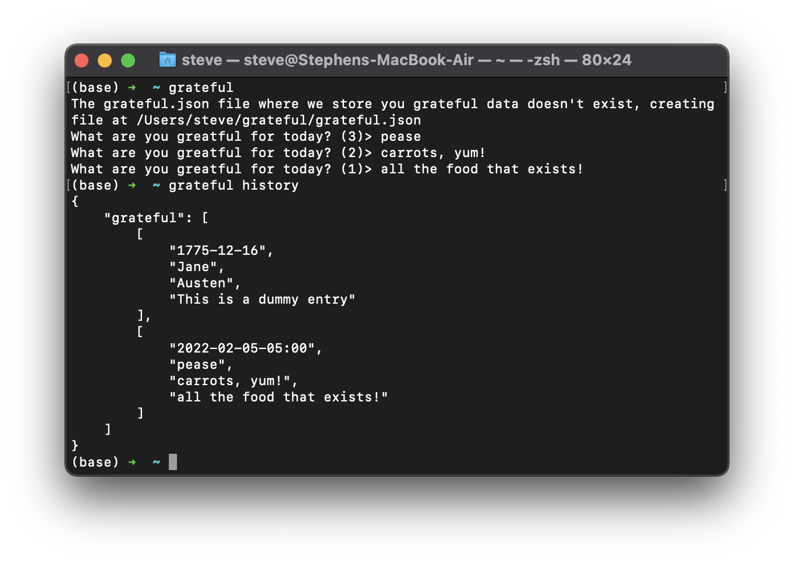

# Grateful

Grateful is a command line interface (CLI) that enables you to boost your happyness by prompting you to write three things that you are grateful for every day. 

### Quick start

Installing this CLI requires `cargo`, the rust package manager. If you don't have it you can get it on mac with `brew install cargo`. Once you have `cargo` install the CLI with

```
cargo install grateful-cli
```

If you're on mac and you don't want to install `cargo` you can also just download the binary `./target/release/grateful` and add it to your `$PATH` 

Enter `grateful` into your terminal and it will prompt you to enter three things you're grateful for. Just type 

```
What are you grateful for today? (3) > beans, I really like beans
What are you grateful for today? (2) > carrots, mmm so fresh
What are you grateful for today? (1) > potatoes, can't do without 'em
```

The **only** other commands are `grateful history` and `grateful last`. These commands display all of your entries and your last entry respectively. 

### Demo video / gif



Does this really work? Yes it does! Doing this excersise every day actually makes you happier. *link to an article*


### Todo

- [ ] Implement tests
- [ ] Better handling of the args
- [ ] Refactor 
  - [ ] improve comments
  - [ ] better file structure
  - [ ] make it more readable in general
- [ ] Better logs (trace error etc)
- [ ] bugfix, `grateful last` returns the first element of the json file instead of the last one. 
- [ ] Find and link supporting documentation that validates claims about how this makes you happy. 

If you like this cli and want a new feature just send me a message! Also, feel free to contribute code if you feel like it. 

### Appendix / MISC

Thanks [Jake](https://github.com/jakewilson/) for inspiring this project. Btw, I stole some of your code from your [tempus](https://github.com/jakewilson/tempus) cli.

Statement of Apology: I am a really stupid person, version 0.0.1 DOESN'T WORK, I'm really sorry about that. Version 0.0.2 works. Please forgive me for this very poor code, it's my first package. I'm also dyslexic, the first package I pushed was miss-spelled "greatful-cli" instead of "grateful-cli". I will yank it and contact the rust people to ask them about removing it. 


